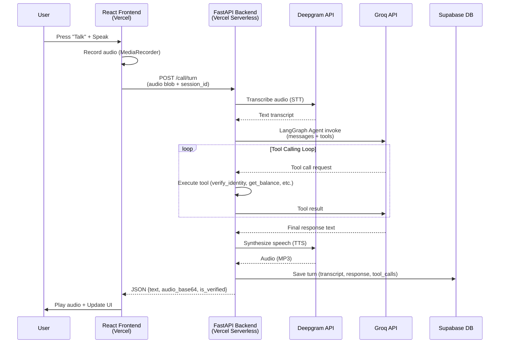
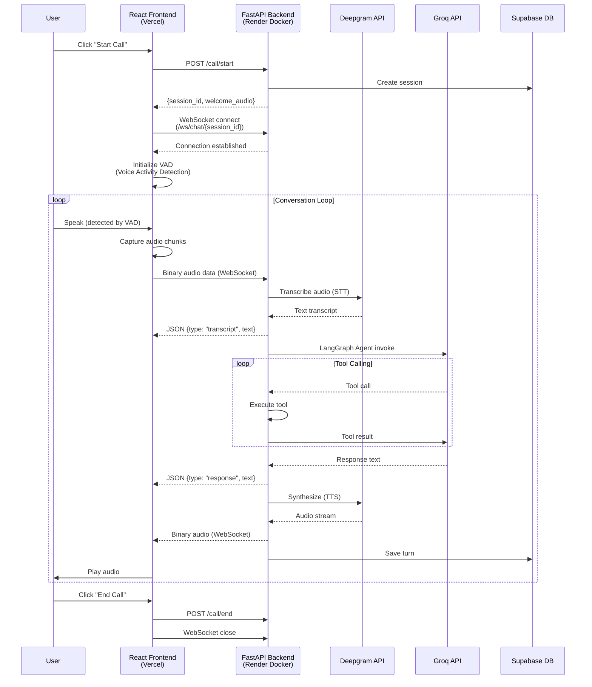
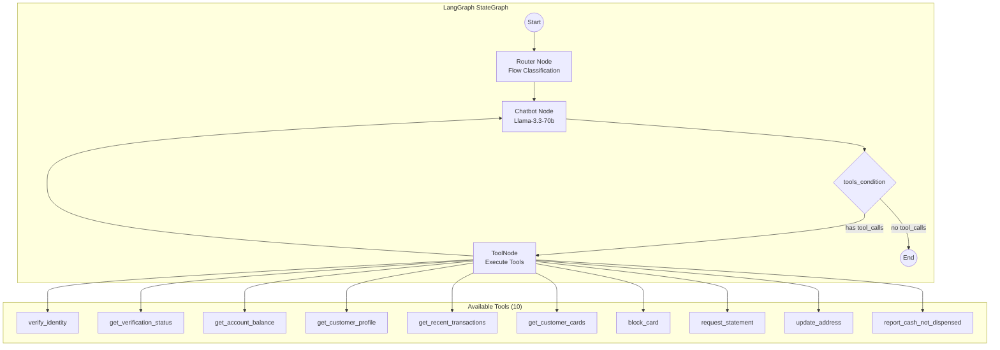

# Bank ABC Voice Agent - Architecture & Implementation Plan

## 1. Executive Summary
This project is a Proof of Concept (POC) for a Conversational Voice AI for "Bank ABC". It handles real-time customer calls, identifies intents, enforces security guardrails (identity verification), and routes users to appropriate banking flows.

The project supports **two deployment architectures**:
- **V1 (HTTP Turn-based)**: Simple, serverless-compatible, higher latency (~2-4s)
- **V3 (WebSocket Real-time)**: Low latency (~500ms-1s), requires persistent server

## 2. Tech Stack

| Component | Technology | Provider/Library | Justification |
| :--- | :--- | :--- | :--- |
| **Frontend** | React (Vite) | `react`, `lucide-react`, `@ricky0123/vad-web` | Fast UI with client-side Voice Activity Detection. |
| **Backend** | Python (FastAPI) | `fastapi`, `uvicorn`, `websockets` | High-performance async API for HTTP & WebSocket. |
| **LLM (Brain)** | Llama-3.3-70b-versatile | **Groq** | Excellent reasoning for complex banking logic & routing. |
| **STT (Ears)** | Nova-2 | **Deepgram** | Low latency, high accuracy transcription. |
| **TTS (Mouth)** | Aura (Asteria) | **Deepgram** | Lowest latency, human-like voice synthesis. |
| **Orchestration** | State Graph | **LangGraph** | Manages conversation state, loops, and tool calling. |
| **Database** | PostgreSQL | **Supabase** | Session persistence, config storage, call logs. |
| **Observability** | Tracing | **LangSmith** | Full trace visibility for debugging and assessment. |

## 3. Architecture Comparison

| Feature | V1 (HTTP Turn-based) | V3 (WebSocket Real-time) |
| :--- | :--- | :--- |
| **Live URL** | [voice-agent-for-bank.vercel.app](https://voice-agent-for-bank.vercel.app) | [voice-agent-for-bank-with-websocket.vercel.app](https://voice-agent-for-bank-with-websocket.vercel.app) |
| **Protocol** | HTTP POST (Request/Response) | WSS (Full-duplex streaming) |
| **Latency** | ~2-4 seconds per turn | ~500ms-1s per turn |
| **Frontend Host** | Vercel (Static) | Vercel (Static) |
| **Backend Host** | Vercel (Serverless Functions) | Render (Docker Container) |
| **Voice Detection** | Manual "Push-to-Talk" | Automatic VAD (Voice Activity Detection) |
| **State Management** | Stateless (per-request) | Persistent WebSocket connection |
| **Cold Start** | Yes (serverless) | No (always-on container) |
| **Scalability** | Auto-scales per request | Requires container scaling |

---

## 4. Architecture Diagrams

### 4.1. V1 Architecture (HTTP Turn-based)



**V1 Characteristics:**
- Each turn is a complete HTTP request/response cycle
- Audio sent as multipart form data
- Response includes base64-encoded audio
- Suitable for serverless deployment (Vercel Functions)
- Higher latency due to cold starts and full request cycle

---

### 4.2. V3 Architecture (WebSocket Real-time)



**V3 Characteristics:**
- Persistent WebSocket connection for the entire call
- Client-side VAD automatically detects speech start/end
- Binary audio streaming (no base64 encoding overhead)
- Separate messages for transcript, response, and audio
- Requires long-running server (Docker on Render)
- Sub-second latency for natural conversation flow

---

### 4.3. LangGraph Agent Architecture (Shared)



**Agent State:**
```python
class AgentState(TypedDict):
    messages: Annotated[list, add_messages]  # Conversation history
    customer_id: str                          # Current customer ID
    flow: Optional[FlowName]                  # Detected flow category
```

---

## 5. Deployment Architecture

### 5.1. Why Hybrid Deployment?

**Vercel Limitation**: Vercel Serverless Functions do not support long-lived WebSocket connections. They are designed for short-lived HTTP requests (typically <10s timeout).

**Solution**: Hybrid deployment model for V3:

```
┌─────────────────────────────────────────────────────────────────┐
│                         INTERNET                                 │
└─────────────────────────────────────────────────────────────────┘
                │                              │
                ▼                              ▼
┌───────────────────────────┐    ┌───────────────────────────────┐
│      VERCEL (CDN)         │    │      RENDER (Docker)          │
│  ┌─────────────────────┐  │    │  ┌─────────────────────────┐  │
│  │  React Frontend     │  │    │  │  FastAPI Backend        │  │
│  │  (Static Assets)    │  │    │  │  - HTTP endpoints       │  │
│  │                     │  │    │  │  - WebSocket /ws/chat   │  │
│  │  - index.html       │  │    │  │  - LangGraph Agent      │  │
│  │  - bundle.js        │  │    │  │  - Tool execution       │  │
│  │  - styles.css       │  │    │  └─────────────────────────┘  │
│  └─────────────────────┘  │    │              │                │
└───────────────────────────┘    │              ▼                │
                                 │  ┌─────────────────────────┐  │
                                 │  │  External APIs          │  │
                                 │  │  - Groq (LLM)           │  │
                                 │  │  - Deepgram (STT/TTS)   │  │
                                 │  │  - Supabase (DB)        │  │
                                 │  └─────────────────────────┘  │
                                 └───────────────────────────────┘
```

### 5.2. Environment Configuration

| Environment Variable | V1 (Vercel) | V3 (Render) |
| :--- | :--- | :--- |
| `GROQ_API_KEY` | Required | Required |
| `DEEPGRAM_API_KEY` | Required | Required |
| `SUPABASE_URL` | Optional | Required |
| `SUPABASE_KEY` | Optional | Required |
| `LANGSMITH_API_KEY` | Optional | Optional |
| `VITE_API_URL` | Backend URL | Backend URL |

## 6. Detailed Component Design

### 6.1. Backend (`/backend`)

| File | Purpose |
| :--- | :--- |
| `main.py` | FastAPI entry point. HTTP endpoints (`/call/start`, `/call/turn`, `/call/end`) + WebSocket (`/ws/chat/{session_id}`) + Admin API (`/admin/*`). |
| `app/agent.py` | LangGraph StateGraph definition. Router node, Chatbot node, ToolNode. LLM binding with model fallback. |
| `app/tools.py` | 10 banking tools with `@tool` decorator. Verification guards. Mock database. Tool enable/disable flags. |
| `app/utils.py` | Deepgram API wrappers for STT (`transcribe_audio`) and TTS (`synthesize_audio`). |
| `app/session_repo.py` | Supabase session and turn persistence. |
| `app/config_repo.py` | Runtime configuration (prompts, tool flags, routing rules) from Supabase. |
| `app/db.py` | Supabase client initialization. |

**Key Endpoints:**

| Endpoint | Method | Purpose |
| :--- | :--- | :--- |
| `/call/start` | POST | Initialize session, return welcome message |
| `/call/turn` | POST | Process one conversation turn (V1) |
| `/call/end` | POST | End session, return goodbye message |
| `/ws/chat/{session_id}` | WebSocket | Real-time bidirectional communication (V3) |
| `/admin/config` | GET/PUT | View/update system prompts |
| `/admin/tools` | GET/PUT | View/update tool enable/disable flags |
| `/admin/routing` | GET/PUT | View/update routing rules |

### 6.2. Frontend (`/frontend`)

| Component | Purpose |
| :--- | :--- |
| `App.tsx` | Main component. Call view + Admin panel. |
| VAD Integration | Uses `@ricky0123/vad-web` for automatic speech detection (V3). |
| WebSocket Handler | Manages persistent connection, handles binary audio + JSON messages. |
| Audio Player | Plays synthesized speech from backend. |
| Admin Panel | Configure prompts, enable/disable tools, edit routing rules. |

**Frontend Modes:**

| Mode | Trigger | Behavior |
| :--- | :--- | :--- |
| Call View | Default | Start/end calls, see conversation transcript |
| Admin View | Click "Admin" button | Edit prompts, toggle tools, save to backend |

### 6.3. Database Schema (Supabase)

```sql
-- Sessions table
CREATE TABLE sessions (
    session_id TEXT PRIMARY KEY,
    customer_id TEXT,
    env_key TEXT DEFAULT 'dev',
    verified_identity BOOLEAN DEFAULT FALSE,
    started_at DOUBLE PRECISION,
    ended_at DOUBLE PRECISION
);

-- Call turns table
CREATE TABLE call_turns (
    id SERIAL PRIMARY KEY,
    session_id TEXT REFERENCES sessions(session_id),
    turn_index INTEGER,
    transcript TEXT,
    agent_response TEXT,
    tool_calls JSONB,
    ts DOUBLE PRECISION
);

-- Configuration table
CREATE TABLE configs (
    env_key TEXT PRIMARY KEY,
    base_system_prompt TEXT,
    router_prompt TEXT,
    tool_flags JSONB,
    routing_rules JSONB,
    updated_at DOUBLE PRECISION
);
```

---

## 7. Data Flow Examples

### 7.1. V1 Flow: Balance Check (HTTP)

```
1. User clicks "Talk", speaks: "What is my balance?"
2. Frontend records audio via MediaRecorder
3. Frontend sends POST /call/turn with audio blob
4. Backend transcribes via Deepgram STT
5. LangGraph agent processes:
   - Router: Classifies as "account_servicing" flow
   - Chatbot: Checks verification status
   - Response: "I can help with that. What is your Customer ID?"
6. Backend synthesizes via Deepgram TTS
7. Backend returns JSON: {text, audio_base64, is_verified: false}
8. Frontend plays audio, updates UI

[User provides ID and PIN in subsequent turns...]

9. Agent calls verify_identity("John123", "1234") → true
10. Agent calls get_account_balance("John123") → {available: 5000.00}
11. Response: "Your checking account balance is $5,000.00"
```

### 7.2. V3 Flow: Balance Check (WebSocket)

```
1. User clicks "Start Call"
2. Frontend: POST /call/start → receives session_id + welcome audio
3. Frontend: Opens WebSocket to /ws/chat/{session_id}
4. Frontend: Initializes VAD (Voice Activity Detection)

5. VAD detects speech start → Frontend shows "Listening..."
6. User speaks: "What is my balance?"
7. VAD detects speech end → Frontend sends binary audio over WebSocket

8. Backend transcribes → sends JSON: {type: "transcript", text: "What is my balance?"}
9. Frontend updates UI with user message

10. LangGraph processes (same as V1)
11. Backend sends JSON: {type: "response", text: "I can help..."}
12. Backend streams binary audio over WebSocket
13. Frontend plays audio while showing response text

[Conversation continues seamlessly...]
```

---

## 8. Tool Calling System

### 8.1. Available Tools

| Tool | Requires Verification | Description |
| :--- | :---: | :--- |
| `verify_identity` | No | Verify customer with ID + PIN |
| `get_verification_status` | No | Check if customer is verified |
| `get_account_balance` | Yes | Get account balance |
| `get_customer_profile` | Yes | Get name, address, phone, email |
| `get_recent_transactions` | Yes | List recent transactions |
| `get_customer_cards` | Yes | List customer's cards |
| `block_card` | Yes | Block a card permanently |
| `request_statement` | Yes | Request monthly statement |
| `update_address` | Yes | Update profile address |
| `report_cash_not_dispensed` | Yes | File ATM dispute |

### 8.2. Tool Flags (Admin Feature)

Tools can be enabled/disabled at runtime via the Admin panel:

```json
{
  "verify_identity": {"enabled": true},
  "block_card": {"enabled": false},
  "get_account_balance": {"enabled": true}
}
```

**Flow:**
1. Admin toggles tool in UI
2. Frontend: `PUT /admin/tools` with updated flags
3. Backend: Saves to Supabase `configs.tool_flags`
4. Backend: Calls `set_tool_flags()` to update runtime state
5. Each tool checks `_is_tool_enabled()` before executing

---

## 9. Implementation Status

### Phase 1: Core Infrastructure ✅
- [x] Project structure (backend/frontend/docs)
- [x] FastAPI backend with async endpoints
- [x] React frontend with Vite
- [x] Environment configuration

### Phase 2: Voice Pipeline ✅
- [x] Deepgram STT integration
- [x] Deepgram TTS integration
- [x] Audio recording (MediaRecorder)
- [x] Audio playback

### Phase 3: Agent Logic ✅
- [x] LangGraph StateGraph with 3 nodes
- [x] 10 banking tools with @tool decorator
- [x] Identity verification guardrails
- [x] Flow routing (6 categories)
- [x] Model fallback for rate limits

### Phase 4: WebSocket (V3) ✅
- [x] WebSocket endpoint `/ws/chat/{session_id}`
- [x] Client-side VAD integration
- [x] Binary audio streaming
- [x] Hybrid deployment (Vercel + Render)

### Phase 5: Admin & Persistence ✅
- [x] Supabase integration
- [x] Session persistence
- [x] Call turn logging
- [x] Admin panel UI
- [x] Runtime prompt configuration
- [x] Tool enable/disable feature

---

## 10. Security & Guardrails

| Guardrail | Implementation |
| :--- | :--- |
| **Identity Verification** | All sensitive tools check `_is_verified()` before executing |
| **PIN Sanitization** | PINs redacted in tool_calls before logging/response |
| **Input Normalization** | Customer IDs and PINs normalized for voice transcription variations |
| **Tool Guards** | Each tool returns `{"error": "identity_not_verified"}` if not verified |
| **System Prompt** | Instructs agent to verify identity before accessing account data |
| **Observability** | All interactions traced in LangSmith |

### Security Warnings (POC Limitations)
- Admin panel has no authentication (open for demo purposes)
- PIN spoken over voice (production would use DTMF keypad)
- Verification state stored in memory (lost on restart)
- Mock database with single test user

---

## 11. Resiliency Features

### 11.1. LLM Model Fallback

When Groq rate limits are hit (429 errors), the system automatically switches models:

```python
_MODEL_CANDIDATES = [
    "llama-3.3-70b-versatile",    # Primary (best reasoning)
    "llama-3.1-8b-instant",       # Fast fallback
    "llama-3.1-70b-versatile",
    "llama3-70b-8192",
    "llama3-8b-8192",
    "gemma2-9b-it",
    "mixtral-8x7b-32768",
]
```

### 11.2. Retry Logic

- Rate limit detection via error message parsing
- Automatic retry with next model in candidate list
- Active model cached for subsequent requests

---

## 12. Test Credentials

| Field | Value |
| :--- | :--- |
| Customer ID | `John123` |
| PIN | `1234` |

**Voice Variations Supported:**
- "John 123", "john-123", "John.123" → normalized to "John123"
- "1 2 3 4", "one two three four" → normalized to "1234"
