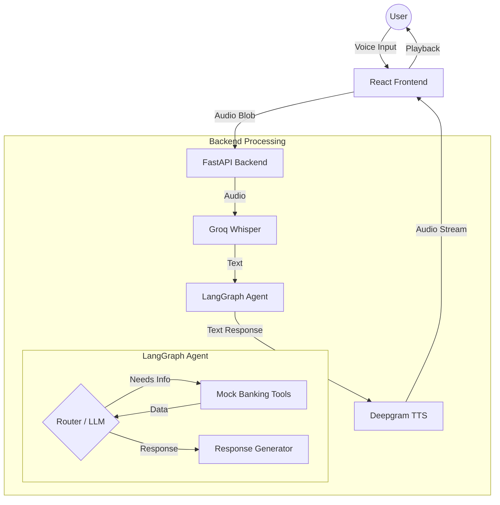

# Bank ABC Voice Agent - Architecture & Implementation Plan

## 1. Executive Summary
This project is a Proof of Concept (POC) for a Conversational Voice AI for "Bank ABC". It handles real-time customer calls, identifies intents, enforces security guardrails (identity verification), and routes users to appropriate banking flows.

## 2. Tech Stack

| Component | Technology | Provider/Library | Justification |
| :--- | :--- | :--- | :--- |
| **Frontend** | React (Vite) | `react`, `lucide-react` | Fast, lightweight UI for "Push-to-Talk" interaction. |
| **Backend** | Python (FastAPI) | `fastapi`, `uvicorn` | High-performance async API to handle audio streams. |
| **LLM (Brain)** | Llama-3.3-70b-versatile | **Groq** | Excellent reasoning for complex banking logic & routing. |
| **STT (Ears)** | Distil-Whisper-v3 | **Groq** | Ultra-low latency transcription. |
| **TTS (Mouth)** | Aura (Nova-2) | **Deepgram** | Lowest latency, human-like voice synthesis. |
| **Orchestration** | State Graph | **LangGraph** | Manages conversation state, loops, and tool calling. |
| **Observability** | Tracing | **LangSmith** | Full trace visibility for debugging and assessment. |

## 3. Architecture Diagram

## 4. Detailed Component Design

### 4.1. Backend (`/backend`)
*   **`main.py`**: Entry point. Handles WebSocket or HTTP POST for audio. Orchestrates the pipeline (STT -> Agent -> TTS).
*   **`app/agent.py`**: Defines the `StateGraph`.
    *   **State**: `messages` (ChatHistory), `user_info` (Mock Session).
    *   **Nodes**: `chatbot` (Llama-3.3-70b), `tools` (Function execution).
    *   **Edges**: Conditional logic to loop back if a tool is called.
*   **`app/tools.py`**: Mock Python functions decorated with `@tool`.
    *   `verify_identity(id, pin)`: **CRITICAL GUARDRAIL**.
    *   `get_balance(id)`: Protected resource.
    *   `block_card(id)`: Sensitive action.
*   **`app/services.py`**: Wrappers for external APIs.
    *   `transcribe_audio(file)`: Calls Groq API.
    *   `synthesize_audio(text)`: Calls Deepgram API.

### 4.2. Frontend (`/frontend`)
*   **Microphone Component**: Uses MediaRecorder API to capture user voice.
*   **Audio Player**: Plays back the returned MP3/WAV from the backend.
*   **Conversation Log**: Displays the transcript of what was said (User vs Agent).

## 5. Data Flow (The Lifecycle of a Request)
1.  **Input**: User presses "Talk" and asks "What is my balance?".
2.  **Upload**: Frontend sends `audio.blob` to `POST /chat`.
3.  **Transcribe**: Backend sends audio to Groq -> Returns "What is my balance?".
4.  **Reasoning**: LangGraph state receives message.
    *   LLM sees history + new message.
    *   LLM checks System Prompt: "MUST verify identity first."
    *   LLM Output: "I can help with that. First, could you provide your Customer ID?"
5.  **Synthesis**: Backend sends text to Deepgram -> Returns Audio.
6.  **Response**: Frontend receives JSON `{ text: "...", audio: "<base64>" }`.
7.  **Output**: Frontend plays audio and updates chat UI.

## 6. Implementation Plan (Roadmap)

### Phase 1: Setup & Configuration (Done)
- [x] Create Project Structure
- [x] Create Virtual Environment
- [x] Install Dependencies (`requirements.txt`)
- [x] Configure `.env` keys

### Phase 2: Core Backend Logic (Done)
- [x] **Step 1**: Implement `app/tools.py` (Mock Banking API).
- [x] **Step 2**: Implement `app/agent.py` (LangGraph with Llama-3.3-70b).
- [x] **Step 3**: Test Agent logic in isolation (Text-only).

### Phase 3: Voice Integration (Done)
- [x] **Step 4**: Implement `transcribe` using Groq.
- [x] **Step 5**: Implement `synthesize` using Deepgram.
- [x] **Step 6**: Create `POST /chat` endpoint in `main.py` to glue it all together.

### Phase 4: Frontend & Polish (Done)
- [x] **Step 7**: Build React UI (Record Button + Chat List).
- [x] **Step 8**: Connect Frontend to Backend.
- [x] **Step 9**: End-to-End Testing (Simulate "Lost Card" flow).

## 7. Security & Guardrails
*   **Identity First**: The Agent System Prompt will strictly enforce `verify_identity` before calling `get_balance`.
*   **Input Validation**: Mock tools will reject invalid IDs.
*   **Tracing**: All interactions logged to LangSmith for audit.
